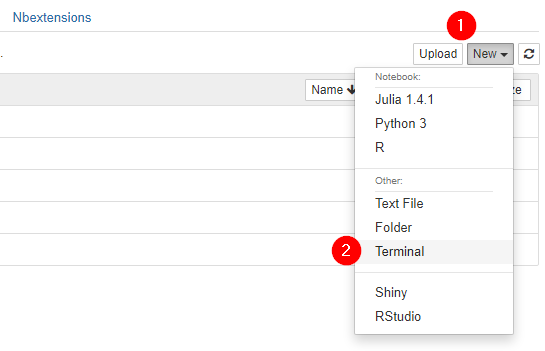
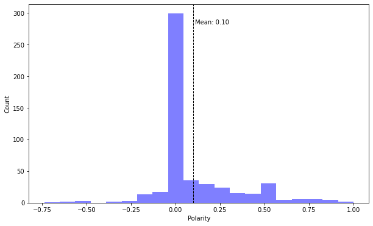

# Twitter Archiver

A python script that archives tweets into a csv file.

This script requires you to have a [Twitter Developer Account](https://developer.twitter.com/en/apply-for-access) with an active app with the following access codes:

- consumer key
- consumer secret
- access token
- access token secret

## Usage

### 1. Clone this repo to JupyterHub

UCLA students:

Use this [gitpuller link](https://jupyter.idre.ucla.edu/hub/user-redirect/git-pull?repo=https%3A%2F%2Fgithub.com%2Fyohman%2Ftwitter&urlpath=tree%2Ftwitter%2F&branch=main) to clone this repo into your JupyterHub account.

### 2. Install requirements



Once inside your JupyterHub, open a new terminal window (as shown above), navigate to the twitter folder (`cd twitter`), and enter the following command:

```
pip install -r requirements.txt
```
### 3. Running the twitter.py script

Once the requirements have been installed, you can begin your twitter archive by running the following command. Replace 'covid' with your search term of interest. Check out [these guidelines](https://developer.twitter.com/en/docs/twitter-api/v1/rules-and-filtering/search-operators) for custom searches:

```console
python twitter.py --q 'covid'
```

There are additional arguments you can pass to refine your search. Here are a list of available arguments:

- `--times` (default=10): How many times to execute the command to get tweets
- `--rest` (default=60): How many seconds to rest between calls to get tweets
- `--location` (defaul=none): Where you want to get tweets from, like Tokyo, or Paris (uses a nominatum geocoder)
- `--distance` (default=50km): Distance in km from the given location to get tweets from
- `--filename` (default="tweets.csv"): csv filename to save your tweets in

#### Query with different time intervals and custom filename

Example: Run 100 times, every 5 minutes, name the file `covid.csv`:

```console
python twitter.py --q 'covid' --times 100 --rest 300 --filename 'covid.csv'
```

#### Query with location

Example: Tweets from within 100km of Los Angeles with custom filename

```console
python twitter.py --q 'covid' --location 'Los Angeles' --distance '100km' --filename 'covid_la.csv'
```

### 4. Analyzing tweets in Jupyter Notebook

Open a new Python Jupyter Notebook and import your tweets

```python
import pandas as pd

df = pd.read_csv('tweets.csv')

# override the default so that we can see the entire text in the column
pd.set_option('display.max_colwidth', None)

# drop duplicates
df = df.drop_duplicates()

```

Full code sample to create a word cloud, polarity index, and add a histogram:

```python
#
# Libraries
#

import pandas as pd
import matplotlib.pyplot as plt

# regular expressions
import re

# for sentiment analysis
from textblob import TextBlob

# word clouds
from wordcloud import WordCloud, STOPWORDS

#
# Bring in tweets
#

df = pd.read_csv('tweets.csv')

# drop duplicates
df = df.drop_duplicates()

#
# Clean the tweets
#

# function to clean tweets using regular expressions
def clean_tweet(tweet):
    return ' '.join(re.sub("(@[A-Za-z0-9]+)|([^0-9A-Za-z \t])|(\w+:\/\/\S+)", "", tweet).split())

# create a new column for the clean text
df['clean_text'] = ''

# loop and add the cleaned up text to the new column
for i, row in df.iterrows():
    clean = clean_tweet(row.text)
    df.at[i,'clean_text'] = clean

#
# Word cloud
#

# now put every word from every tweet into a single variable
all_text = ' '.join(df['clean_text'])
    
# create the word cloud
wordcloud = WordCloud(width=1200, 
                      height=800,
                      background_color="white").generate(all_text)

# Display the WordCloud                    
plt.figure(figsize=(12,12))
plt.imshow(wordcloud, interpolation="bilinear")
plt.axis("off")
plt.show()    
    
#
# Sentiment Analysis
#

# create an new (empty) column for polarity
df['polarity']=''

# loop through every row and add the polarity value in our new column
for i, row in df.iterrows():
    a = TextBlob(row.clean_text)
    df.at[i,'polarity'] = a.polarity

# set up the histogram
plt.figure(figsize=(10,6))

n, bins, patches = plt.hist(df.polarity, 
                            bins=20, 
                            facecolor='blue', 
                            alpha=0.5)

plt.xlabel('Polarity')
plt.ylabel('Count')

# add the mean
plt.axvline(df.polarity.mean(), 
            color='k', 
            linestyle='dashed', 
            linewidth=1)

# label the mean
min_ylim, max_ylim = plt.ylim()
plt.text(df.polarity.mean()*1.1, max_ylim*0.9, 'Mean: {:.2f}'.format(df.polarity.mean()))

plt.show();
```


